# BIRM — Information Flow

**Status: derived, wave F1f. A re-reading of `_brainstorm/birm-spec.md` §3–§9; no new decision, no ledger row.** Every claim below is a restatement except two, both in §1.2 and both marked there as the flow's own: that `D50`'s phase clock already pays for the reverse read's arbiter, and that 9b's read of the scaffold is exact. Where the flow is under-determined — or where two spec cells disagree — the `?` is carried through as a §6 seam rather than filled.

> **What this document is.** The wiring seen as a *graph*, and then the same graph seen as a *story*. Part I is the schema: nodes, edges, what each edge carries and when it is live. Part II walks a signal through it — one observation in, one action out — and then through the two off-line modes. It is written for the reader who has understood §3 and §4 separately and wants to see them move.
>
> **What it is not.** Not a decision surface. A cell here that disagrees with `birm-spec.md` is wrong by construction; the spec wins and this file is patched. Nothing here supersedes anything (spec `R2`).

> **Prose warning.** Spec `R5` caps prose because a paragraph there is a symptom of a missing decision. It is deliberately lifted in Part II: the narration exists precisely to say what the tables cannot, which is *ordering*. Part I stays under `R5`.

---

# Part I — The schema

## 1. Nodes

| Node | Kind | Holds between steps | Clock |
|---|---|---|---|
| **Periphery** | adapter, **outside BIRM** | nothing (fixed codec) | env step |
| **Cortex** | slow model | `W` (codes + associative weights); `g_t` | written only on the transport channel |
| **Hippocampus** | fast instance store | content slots, pointer register, occupancy, per-feature variance, provenance bit | one-shot write; scheduled read; typed erase only |
| **PFC** | controller | task model (sustained, swapped); `k` engagement gains; pointer/schedule registers | per step |
| **Thalamus** | arbitrator / commit gate | mode, `g_rel`, `g_acq`, `k` engagement gains, slow set-points | fast switch, slow set-point |
| **Neuromodulators** | metaparameter source | eight set-points | second-order — strictly slower than what it gates |

Six organs, no seventh (§3.6). No competence estimator, no conflict/difficulty/error/novelty detector, no transfer path out of `PFC`, no feedback into perception.

### 1.1 Three of those nodes are not one unit each

**Six organs is a claim about organs, not about wires.** `Cortex`, `PFC` and `Hippocampus` each carry two or more parts that the spec *already addresses separately* — **O** is admitted to "`Cortex`'s `x` half **only**" and denied to "the `g` half" (§4, `D15`/`D65`); **Bg**'s reader list names "`Cortex`'s conjunction" as a third thing; `PFC`'s read port and write port "are different modules" (`D171`). Drawing each as one box forces one arrow to mean two different things — which is why the observation edge had to be labelled *"x half only"* to stay true. Naming the parts removes the label. `Hippocampus` is split for a different reason, given in §1.2: its two reads cross the **same** layer in opposite directions, and one box cannot show a direction.

**A sub-unit is not an organ.** Sub-units of one organ are joined by internal wires that are **not buses**; nothing outside the organ addresses a sub-unit by name; no sub-unit has its own `L_part`, its own **U** decoder, or its own row in §3. §3.6 is untouched.

| Organ | Sub-unit | What it is | Architecturally denied to it |
|---|---|---|---|
| **Cortex** | **`CX·g`** — the structural half | path integrator: `g_t = ℓ₂(W_{a_{t−1}} g_{t−1})`, `W_a = f_g(a)` *computed* from the action index (§6's operator form with §5.1's index — the two spec cells differ, §6 seam). One matvec, feed-forward, no settling. Where `f_g` itself lives is unplaced — §6 seam. **Deterministic — required** (`D88`). `n_mod = ⌈log_K Ŝ⌉` modules of width `K` | **O**, at every beat and in every mode (`D15` → `D65`) |
| **Cortex** | **`CX·x`** — the content half | settles `m⁻` in phase α, `m⁺` in phase β; iteration count not fixed in advance. Width follows `D_o`. **Stochastic — determinism forbidden** (`D88`) | nothing on the observation side: it is the **only** place **O** lands |
| **Cortex** | **`CX·p`** — the context term | the single point inside the organ where the context wire meets the content half, and the reason `g` needs no content of its own. **Deliberately unlabelled by any equation** — `f` is spoken for: §6 retypes it as the *hippocampal* addressed write (`D165`), so writing `p = f(g, x)` here would name the TEM place cell BIRM declines. What `CX·p` computes is `?` (§6) | forming a `g` route back: content enters *through* `p`, never *into* `CX·g` |
| **Cortex** | **`CX·W`** — codes + associative weights | two **separately addressable** parameter blocks. The target of the offline transport channel, and only the associative block moves — the mapping, not the terms (`D23`) | every online write (§3.1(i)); scheduling its own transport (`D57`, `D58`) |
| **PFC** | **`PF·lv`** — the `k` level-searchers | the task model, sustained and swapped, never accumulated; all `k` live from step 1 (`D29`); level `j+1` receives only `(abstract variable, resolved output)` from `j` (`D31`); `gain_j ← σ(H[π_j] − h₀)` (`D30`) | **O** at every level; any adjacency matrix (§3.1 `D205`) |
| **PFC** | **`PF·act`** — the action port | emits `Act`, one-hot over `k` | every reader but the Periphery (plus the efference copy, §6) |
| **PFC** | **`PF·cmd`** — the write / bias port | `L_cmd` into `Hippocampus`; the additive bias into `CX·x` and into the `Hippocampus` read; the operating-point offset into `Neuromodulators` | routing, gating, rewiring (E13); writing to `Cortex` (`D25`); setting a gain (E14) |
| **Hippocampus** | **`HC·scaf`** — the scaffold | the frozen random `g →` slot projection and the fixed points it induces. **Decides which slots exist**, and holds none of their contents. Capacity is this object: `N_slots = c·n_mod` (`D17`, `D18`, `D68`) | holding content; being unfrozen — the one case that unfroze a scaffold got worse (`D68`); carrying any learned similarity (`D188`) |
| **Hippocampus** | **`HC·cont`** — the content layer | the plastic one-shot layer: the conjunction `(Δ, a_{t−1}, r_t)`, per-slot occupancy, per-feature variance, the provenance bit (`D76`, `D74`, `D173`). **Crossed in both directions** — see §1.2 | **defining the fixed points.** Content never touches the recurrent dynamics; that is what `D68` buys over a Hopfield store |
| **Hippocampus** | **`HC·conf`** — the read-confidence monitor | the per-read confidence scalar emitted alongside retrieved content (`D69`), and the store's occupancy scalar (§3's output list; no ledger row). A two-threshold read of aggregate activity — **not** a product of the relaxation | being inferred from the retrieved content itself: relaxation supplies no certificate, which is the whole reason this exists |

**Why exactly these seams and not others.** Each one is a place the **Denied** column already cuts. `CX·g`/`CX·x` is cut by **O**; `CX·W` is cut by *when* — it is the one block no online edge may move; `CX·p` is cut by `D45`'s two-wire rule, being the only node fed by both wires. `PF·lv`/`PF·cmd` is cut by `D171`, and `PF·act` splits off `PF·cmd` because `Act`'s denial list and `L_cmd`'s are disjoint. `HC·scaf`/`HC·cont` is cut by `D68`'s regime choice, and `HC·conf` by the fact that a confidence scalar cannot come from the process it certifies. No seam is drawn where the spec denies nothing.

### 1.2 Why `Hippocampus` splits, and what it costs

`D68` puts the store in the **prestructured-scaffold** regime and denies the content-defined (Hopfield) one. The wiki states that choice as a single sentence — *content never touches the recurrent dynamics* — and the consequences follow from it:

| | Content-defined (denied) | Prestructured scaffold (`D68`) |
|---|---|---|
| Fixed points set by | the stored patterns | frozen dynamics; content hung on after |
| Basins | uneven, spurious mixture states | convex, uniform, spurious-free |
| Capacity | linear in fan-in | exponential, set by the **address space** |
| Overload | catastrophic | degrades **resolution, not identity** |

So the store is **address-defined and content-bearing**, and the two are different objects — which is what makes the two reads drawable:

| Read | Direction | Returns | Fidelity |
|---|---|---|---|
| **step 4** | `HC·scaf → HC·cont` | the stored conjunction, onto `Bx⁻` | approximate — this is the half `D68`'s overload degrades |
| **step 9b** | `HC·cont → HC·scaf` | a **`g`**, onto `Bg` | **exact** — scaffold states are recovered exactly where content is not |

The 9b row is the one the spec asserts and never grounds. It is why recall can repair `g` *at all* while `D68` is simultaneously conceding that content resolution decays: 9b reads out the precise half of the store. **The write crosses only one of these** — `write(addr=g, content)` is `HC·scaf → HC·cont` and has no content-side degree of freedom, which is what keeps `g` free of content correlations (`D18`) and keeps `ρ` an audit rather than a tautology (`D64`, `O28`).

**And 9b is a reverse read, which is never free.** In the wiki's inventory every fast store exposes one read direction and answers the reverse query only by scanning; its one store that does answer it pays **a duplicate weight matrix plus an arbiter** to stop the two directions corrupting each other. BIRM pays half of that and has not booked the other half:

| Half | Status |
|---|---|
| **the arbiter** | **already paid, and worth claiming.** `D50`'s two-phase clock time-separates the directions — step 4 sits in phase α, 9b after step 9 in phase β — which is exactly what the arbiter buys. BIRM does not need one |
| **the second matrix** | **unbooked.** `D32`'s five primitives contain no `content → g`. The cheap route is a bidirectionally plastic `HC·cont`, which is what the scaffold model BIRM cites actually uses — but no decision row says `HC·cont` is bidirectional. §6 |

One thing the split makes precise. `HC·scaf` has **no similarity structure at all** — a frozen random projection makes two near-identical memories as far apart as two unrelated ones. So 9b's "a **similar** observation" cannot mean graded or semantic similarity; it can only mean *a cue that falls inside a stored pattern's basin*, resolved by relaxation in one settling pass. Read that way §3.2's hazard row ("give me the stored structures like this one is unanswerable") and step 9b stop contradicting each other: the hazard is about `HC·scaf`, the read is about `HC·cont`.

## 2. The eight buses

> **Read this before the diagram.** BIRM has **eight buses, not eight kinds of arrow**. A bus is one wire with one writer-class and several readers, and the *same* signal means something different at each reader — that is the spec's rule, not an accident: *a signal means what it means because of who is allowed to read it*. So `V` appearing four times in a diagram is not four signals; it is one scalar being decoded four ways. The bus roster is the short version; §2.2 draws the readers; §2.3 says what each reader actually takes.

| Bus | It is literally | Written by | How many readers |
|---|---|---|---|
| **O** | `o_t`, a float vector | Periphery | **1** |
| **Bg** | `g_t` — an **address**, content-free | `CX·g` (the integrator); `HC·scaf` (the 9b reset) | 3 (§4) — plus `CX·g` reading its own state back, which is not a bus read |
| **Bx** | `x` — content, in two registers `Bx⁻` (predicted) / `Bx⁺` (observed) | `CX·x` | 4 |
| **U** | `m_t`, one low-dimensional vector | Neuromodulators | every organ |
| **V** | **one scalar**, no address | Periphery (`r_t`); `CX·x` (residual) | 5 |
| **L** | `L_cmd` (a typed struct) + `L_part` (one gate per organ) + the offline transport enable | `L_cmd`: `PF·cmd`. `L_part`: every organ, about itself. transport enable: `HC·cont` | 3 sub-paths |
| **W** | the published payload + `scope` + `generated` | Thalamus (the gate) + the winner (the payload) | all organs |
| **Act** | one-hot over `k` | `PF·act` | Periphery (+ efference copy to `CX·g` and `HC·cont` — see §6) |

**Two of them go to the same readers and are still not redundant.** `Bg` and `Bx` are the physical form of the `g`/`x` split: every organ pair joined by a content edge is *also* joined by a relayed context edge, and the two carry **different variables**, not a re-typed copy of one. That is what makes the whole Denied column enforceable by wiring instead of by a loss.

### 2.2 The graph

Buses are drawn as **bars**. An arrow *into* a bar is a writer; an arrow *out* is a reader, labelled with **what that reader takes off it**. `Cortex`, `PFC` and `Hippocampus` are drawn as **boxes containing their §1.1 sub-units**, so that every bus arrow lands on the part that actually reads it — the observation edge no longer needs the word *"half"* on it to be true, and the store's two reads are visibly one layer crossed in two directions.

```mermaid
flowchart LR
  ENV([environment])
  A0["Periphery<br/>(adapter — not BIRM)"]

  subgraph CX["Cortex — the slow model"]
    CXG["**CX·g** — structural half<br/>path integrator, deterministic<br/>**O** denied at every beat"]
    CXX["**CX·x** — content half<br/>settles m⁻ (α) → m⁺ (β), stochastic<br/>the only place **O** lands"]
    CXP(("**CX·p**<br/>the context term<br/>form: ?"))
    CXW[("**CX·W** — codes +<br/>associative weights<br/>written only offline")]
    CXG -->|"g — context"| CXP
    CXX -->|"x — content"| CXP
    CXW -.->|"the map m⁻ settles under"| CXX
  end

  subgraph PF["PFC — the controller"]
    PFL["**PF·lv** — k level-searchers<br/>task model, sustained · j → j+1 only<br/>gain_j from its own output entropy"]
    PFA["**PF·act** — the action port"]
    PFW["**PF·cmd** — the write / bias port"]
    PFL --> PFA
    PFL --> PFW
  end

  subgraph HC["Hippocampus — the fast instance store"]
    HCS["**HC·scaf** — the scaffold<br/>frozen random g → slot projection<br/>content-free · sets which slots exist"]
    HCC["**HC·cont** — the content layer<br/>plastic, one-shot · holds (Δ, a at t−1, r_t)"]
    HCQ(["**HC·conf** — read confidence<br/>two-threshold read of aggregate activity"])
    HCS -->|"step 4: address → content"| HCC
    HCC -->|"9b: content → address (reverse read)"| HCS
    HCC -.->|"aggregate activity"| HCQ
    HCQ -.->|"licenses 9b above threshold"| HCS
  end

  TH{{"Thalamus"}}
  NM(["Neuromodulators"])
  CR{{"the credit path<br/>(plasticity only)"}}

  O[/"**O** — o_t"/]
  BG[/"**Bg** — the address g"/]
  BX[/"**Bx** — content, Bx⁻ / Bx⁺"/]
  UU[/"**U** — m_t"/]
  VV[/"**V** — one scalar, no address"/]
  LL[/"**L** — L_cmd + L_part"/]
  WW[/"**W** — the commit"/]
  AC[/"**Act** — one-hot over k"/]

  ENV -->|"o_t, r_t"| A0
  AC -->|"actuate"| A0
  A0 --> ENV

  A0 -->|"o_t"| O
  A0 -->|"r_t"| VV
  CXX -->|"residual"| VV
  CXG -->|"g_t — the integrated address"| BG
  HCS -->|"offset-preserving reset (9b)"| BG
  CXX -->|"Bx⁻ (phase α) then Bx⁺ (phase β)"| BX
  HCC -->|"retrieved transition"| BX
  NM -->|"m_t"| UU
  PFW -->|"L_cmd"| LL
  HCC -->|"transport enable g(r_S) — rest only"| LL
  CX -.->|"L_part (all organs, each about itself)"| LL
  PFA -->|"a_t, one-hot"| AC
  TH ==>|"the gate"| WW
  CXX -.->|"payload — the winner's, drawn here from CX·x; a copy, never a transform"| WW

  O -->|"o_t clamps the plus phase — phase β"| CXX
  BG -->|"g at t−1, plus 9b's reset"| CXG
  BG -->|"the context term"| CXP
  BG -->|"the store **address**"| HCS
  BG -->|"level context"| PFL
  BX -->|"retrieved transition → settles m⁻"| CXX
  BX -->|"Bx⁺ as the 9b cue — the write itself reads W, §6"| HCC
  BX -->|"what is here"| PFL
  BX -->|"**aggregate activity only**"| TH
  UU -->|"α — transport rate"| CXW
  UU -->|"read gains"| HCC
  UU -->|"β + the epistemic gate"| PFL
  UU -->|"resting distance from threshold"| TH
  VV -->|"the write gate"| HCC
  VV -->|"task return"| PFL
  VV -->|"Var(δ), sign, level"| NM
  VV -.->|"transport gate per §4's reader list — §5.3 gates on L, §6"| CXW
  VV -->|"residual → mode arbitration (g_rel) — never the threshold, D54"| TH
  LL -->|"addr · lead time · erase"| HCC
  LL -.->|"transport enable"| CXW
  LL -.->|"L_part — δ_j = gate_j · δ"| CR
  WW ==>|"broadcast, one hop"| CX
  WW ==> HC
  WW ==> PF
  WW ==> TH
  WW ==> NM
  AC -.->|"efference copy — the operator W_a"| CXG
  AC -.->|"into the write conjunction"| HCC

  HCQ -->|"occupancy · read-confidence"| NM
  PFW -->|"operating-point offset — never a gain"| NM
  PFW -->|"bias — additive, never routing"| CXX
  PFW -->|"bias into the read"| HCC
  TH -->|"g_rel / g_acq over *edges*"| CXX
  TH -->|"per-level engagement gains"| PFL
  PFL -->|"per-level output entropies H[π_j]"| TH
  TH -->|"attenuates the read path — phase β"| HCC
  TH -->|"phase bit α/β"| CXX
```

**Four things the split makes visible that the single-box drawing hid.**

| | Before | Now |
|---|---|---|
| The observation edge | one arrow into `Cortex` carrying the caveat *"x half only"* — a denial written as an arrow label | the arrow lands on `CX·x`, and `CX·g` has no incoming **O** edge to deny |
| The transport channel | `V`, `U` and `L`(transport) all arrived at the same box as the online traffic | all three land on `CX·W`, which no online edge touches — the "written only offline" row is now a fact about the picture |
| `PFC`'s four outputs | one box emitting `Act`, `L_cmd`, two biases and an offset | `Act` leaves `PF·act`; everything else leaves `PF·cmd`. `D171`'s "read port and write port are different modules" is drawn rather than asserted |
| The store's two reads | two arrows leaving one box, one returning content and one returning an address, with nothing to say why | **one layer crossed in two directions**: step 4 down, 9b back up. The write crosses only downward, which is the whole of `D18`'s anti-collapse argument seen as a picture |

### 2.3 What each reader takes off the bus it shares

This is the table that dissolves the "why so many `V`" question. One row per **(bus, reader)** pair — same wire, different decode.

| Bus | Reader | What that reader takes | What it does with it |
|---|---|---|---|
| **V** | Hippocampus — `HC·cont` | the scalar | opens the **write gate** — should this conjunction be stored |
| **V** | PFC — `PF·lv` | the scalar | **task return** — the only objective PFC has |
| **V** | Neuromodulators | the scalar's *statistics*: `Var(δ)`, sign-oscillation, level | sets `γ`, `β`, `α` — never the raw value |
| **V** | Cortex — `CX·W` | the scalar | listed by §4 as the offline **transport gate** — but §5.3 step 3 gates transport on `g(r_S)` over **L**, and §3's Cortex input list carries no **V**. Seam (§6). Either way the reader is the *parameter block*, never the online path |
| **V** | Thalamus | the residual | raises `g_rel` — mode arbitration (§5.2 step 1). **Never the commit threshold**, which reads aggregate `Bx` (`D54`, `O17`) |
| | | **The scalar carries no address.** Which organ it belongs to comes from `L_part`, on the credit path, never from the signal. Any organ consuming `V` without emitting `L_part` inherits spurious credit by construction. | |
| **U** | Cortex — `CX·W` | `f_CX(W_CX·m_t)` → learning rate | how fast a transport step moves a weight |
| **U** | Hippocampus — `HC·cont` | `f_HC(W_HC·m_t)` → read gains | — |
| **U** | PFC — `PF·lv` | `f_PF(W_PF·m_t)` → `β`, epistemic gate | exploration temperature; can zero the epistemic term |
| **U** | Thalamus | `f_TH(W_TH·m_t)` → resting distance, pool decay | how easily BIRM commits — and therefore how deep it can plan |
| | | **No organ reads `m_t` raw and no organ shares another's decoder.** There is no global gain to turn up. | |
| **Bg** | Hippocampus — `HC·scaf` | the code, **as an address** | which slot is read and written. A position, not a want. This is the **only** wire that selects a slot |
| **Bg** | PFC — `PF·lv` | the code, as **level context** | which task-model context is live |
| **Bg** | Cortex — `CX·g` | the code, as **its own state** | the next integration step, and 9b's reset folded in |
| **Bg** | Cortex — `CX·p` | the code, as the **context term** | the one node fed by both wires. §4's reader list names it; nothing says what it computes |
| | | **Content-free at all three bus readers.** `g` decides *which* slot, and supplies none of *what* is in it. The `CX·g` row is the integrator's own state, listed so the 9b reset has a landing point — not a fourth reader (§4 lists three). | |
| **Bx⁻** | Cortex — `CX·x` | the retrieved transition | settles `m⁻` — the prediction |
| **Bx⁺** | Hippocampus — `HC·cont` | the observed content | at 9b, the cue for the **reverse** read. The write (step 9) reads **W**, not `Bx` (§5.1); which wire supplies `m⁻` to form `Δ` at the write is unsaid — §6 |
| **Bx⁺** | PFC — `PF·lv` | the content estimate | what is here, for selection |
| **Bx⁺** | Thalamus | **aggregate activity only — never the payload** | the commit threshold test |
| **O** | Cortex — `CX·x`, and nothing else in `Cortex` | `o_t` | clamps the plus phase — **and only in phase β** |
| **L_cmd** | Hippocampus — `HC·cont` | address, **lead time**, erase type — written by `PF·cmd` | schedules the read; licenses the write |
| **L**(transport) | Cortex — `CX·W` | `HC·cont`'s enable `g(r_S)` | opens the one channel that moves a slow weight; **rest periods only** |
| **L_part** | the credit path | `gate_j`, per organ | `δ_j = gate_j · δ`. **The action path may not read it** |
| **W** | every organ | payload + `scope` + `generated` | one global revision in one hop |
| **Act** | Periphery | the index, written by `PF·act` | actuate |
| **Act** | Cortex — `CX·g`; Hippocampus — `HC·cont` | the **efference copy** | the operator `W_a` for integration; the `a_{t−1}` slot of the written conjunction |

### 2.4 Organ to organ — what actually crosses

No organ writes to another organ directly. Every pair below is joined **through a bus**, and a pair joined at all is usually joined **twice** — once on the content wire, once on the relayed context wire, carrying different variables.

**Endpoints are given at §1.1 granularity.** A row that reads `Cortex` without a sub-unit is one where the spec does not resolve further.

| From → To | Bus(es) | What crosses | When |
|---|---|---|---|
| Periphery → `CX·x` | **O** | `o_t` | phase β only. **No row reaches `CX·g`** |
| Periphery → Hipp / `PF·lv` / NM | **V** | `r_t`, one scalar, no address | every step |
| **`CX·g` → `HC·scaf`** | **Bg** | **`g_t` — the address.** Picks the slot; carries none of its contents | every step (step 3) |
| **`CX·x` → `HC·cont`** | **Bx** | **the content register** — `Bx⁻` at the read, `Bx⁺` at 9b's compare | steps 4 and 9b |
| *(`CX·x` → `HC·cont`, indirectly)* | **W** | the **committed content** — the store's write reads **W**, not `Bx` (§5.1 step 9). `Δ = m⁺ − m⁻` is formed at the write; the spec does not say which wire supplies `m⁻` there (§6) | step 9 |
| `CX·g` + `CX·x` → `PF·lv` | **Bg** + **Bx** | level context; content estimate — **two sub-units, two wires**, separately silenceable | every step |
| `CX·x` → Thalamus | **Bx⁺** + **V** | **aggregate activity only** (the threshold test); the prediction residual (mode arbitration, not the threshold — `D54`) | phase β |
| `CX·g` → `CX·p` ← `CX·x` | *internal, not a bus* | the context term and the content term | every step |
| `HC·cont` → `CX·x` | **Bx** | the retrieved transition → `Bx⁻` | step 4 |
| `HC·scaf` → `CX·g` | **Bg** | the discrete **offset-preserving reset** of `g` | step 9b, above threshold only |
| `HC·cont` → `HC·scaf` | *internal, not a bus* | the **reverse read**: content cue → the address whose basin holds it | step 9b, above threshold only |
| `HC·scaf` → `HC·cont` | *internal, not a bus* | the forward read: address → the conjunction stored there | step 4; and the write, step 9 |
| `HC·cont` → `CX·W` | **L** | the transport enable `g(r_S)` | rest periods only — the gate §5.3 specifies; §4's `V` reader on the same block is a seam (§6) |
| `HC·cont` + `HC·scaf` → `PF·lv` | **Bx** + **Bg** | retrieved content; level context — both wires, separately silenceable | on the schedule |
| `HC·conf` → NM | — | occupancy scalar, read-confidence scalar | continuous |
| `PF·cmd` → `HC·cont` | **L_cmd** + bias | address, **lead time**, erase type; an additive bias into the read | every step |
| `PF·cmd` → `CX·x` | bias | additive bias, never routing | every step |
| `PF·act` → `CX·g` / `HC·cont` | **Act**(t−1) | the efference copy `a_{t−1}` | steps 3 and 9 |
| `PF·cmd` → NM | — | operating-point offset per component, **never a gain** | every step |
| `PF·act` → Periphery | **Act** | one-hot over `k` | step 10 |
| `PF·lv` → `PF·act` / `PF·cmd` | *internal, not a bus* | the resolved level output | every step |
| Thalamus → `CX·x` | — | `g_rel` / `g_acq` over *edges*; the phase bit | mode switch / every step |
| Thalamus → `PF·lv` | — | per-level engagement gains | every step |
| `PF·lv` → Thalamus | — | per-level output entropies `H[π_j]` — the input the engagement gains are computed from (§3, `D30`) | every step |
| Thalamus → `HC·cont` | — | the read-path attenuation that hands the driving source from the store to **O** (§5.1 step 6) | phase β |
| Thalamus → **W** | **W** | the gate — open or closed | ≤1 / step |
| NM → every organ | **U** | `m_t`, decoded privately by each | second-order |
| **W** → every organ | **W** | payload + `scope` + `generated` | at commit, one hop |

## 3. Edges, one row each

> §2.3 is the same wiring indexed **by bus** and says what each reader decodes. This table is indexed **by edge** and adds the two things that one cannot carry: **when the edge is live**, and **who is denied it**. Endpoints are §1.1 sub-units where the spec resolves that far. The three `I` rows at the bottom are **internal** to one organ: no bus, no `L_part`, no §4 row — they are listed only so that the diagram has no unaccounted arrow.

| # | From → To | Bus | Carries | Live when | Denied |
|---|---|---|---|---|---|
| E1 | env → Periphery | — | `o_t`, `r_t` | every env step | — |
| E2 | Periphery → `CX·x` | **O** | `o_t` | **phase β only** | **`CX·g`**; `PF·lv` at every level; Thalamus; Neuromodulators; Hippocampus; **phase α** |
| E3 | Periphery → {Hipp, `PF·lv`, NM} | **V** | `r_t`, one scalar, **no address** | every step | carrying an address — the address comes from `L_part` |
| E4 | `CX·g` → `HC·scaf` | **Bg** | `g_t` as the store **address** | step 3, every step | time-locking to `Bx`; carrying content |
| E5 | `CX·g` → `PF·lv` | **Bg** | level context | every step | — |
| E6 | `CX·x` → Hipp / `PF·lv` | **Bx** | content estimate, registers `Bx⁻` / `Bx⁺` | α writes `Bx⁻`, β writes `Bx⁺` | carrying context |
| E7 | `CX·x` → Thalamus | **Bx⁺** (online) / **Bx⁻** (rollout, §5.2 step 5) | **aggregate activity only** — the threshold test | phase β; every rollout step | reading the payload |
| E8 | `CX·x` → Thalamus / NM | **V** | prediction residual — at Thalamus the mode-arbitration input (`g_rel`, §5.2 step 1) | every step | carrying an address; **feeding the commit threshold** (`D54`) |
| E9 | `HC·cont` → `CX·x` | **Bx⁻** | retrieved transition at `g_t` | step 4, on the `PF·cmd`-set schedule | choosing its own address or lead time |
| E10 | `HC·scaf` → `CX·g` | **Bg** | discrete **offset-preserving reset** of `g` | step 9b, only above the read-confidence threshold | blending; being driven by `O` |
| E11 | `HC·conf` → NM | — | occupancy scalar, read-confidence scalar | continuous | — |
| E12 | `PF·cmd` → `HC·cont` | **L_cmd** | address, **lead time**, erase type (`clear` / `suppress`) | every step, for `t+1` | issuing "which slot" without a time and a removal type |
| E13 | `PF·cmd` → `CX·x`, `PF·cmd` → Hipp read | — | additive **bias** into a running competition | every step | routing, gating, rewiring; reaching `CX·g` or `CX·W` |
| E14 | `PF·cmd` → NM | — | operating-point offset per component | every step | setting a gain |
| E15 | `PF·act` → Periphery | **Act** | one-hot over `k` | step 10 | every other reader |
| E16 | `PF·act` → `CX·g` / Hipp | **Act**(t−1) | efference copy — the carrier of path integration and of the write conjunction | steps 3 and 9 | — |
| E17 | Thalamus → **W** | **W** | the gate itself | ≤ 1 commit / step; **may fire with no request** | — |
| E18 | winner → **W** | **W** | payload, **a copy never a transform**, + `scope` + `generated` | at commit | transforming the payload |
| E19 | **W** → all organs | **W** | the published content, one hop to every level | for a dwell time, exclusive | a second broadcaster |
| E20 | Thalamus → edges (drawn into `CX·x`, the first internal-periphery receiver) | — | `g_rel` (internal-periphery), `g_acq` (external-reader) | mode switch | one scalar over an *organ* instead of two gains over *edges* |
| E20b | Thalamus → `CX·x` | — | the phase bit α/β | every step | being set by `PFC`, or by anything that inspects `o_t` |
| E21 | Thalamus → `PF·lv` | — | per-level engagement gains | every step | — |
| E21b | `PF·lv` → Thalamus | — | per-level output entropies `H[π_j]` — what `D30`'s gains are computed from (§3's Thalamus input list) | every step | carrying content; carrying **O** |
| E20c | Thalamus → `HC·cont` | — | read-path attenuation — the in-step handover from the store to **O** (§5.1 step 6, `D51`) | phase β | being set by `PFC` |
| E22 | NM → every organ | **U** | `m_t`, decoded as `f_k(W_k·m_t)` | second-order | any organ reading `m_t` raw; any global gain |
| E23 | every organ → credit path | **L_part** | that organ's licence **on itself** | every step | being read by the action path; being written for another organ |
| E24 | `HC·cont` → `CX·W` | **L**(transport) | the offline gate `g(r_S)` — the gate §5.3 specifies; §4 also lists **V** at this block (§6) | rest periods only | firing online; reaching `CX·g` or `CX·x` |
| **I1** | `CX·g` + `CX·x` → `CX·p` | *internal* | the context term and the content term | every step | a return path — `p` never writes back into `CX·g` |
| **I2** | `CX·W` → `CX·x` | *internal* | the map both `m⁻` and `m⁺` settle under | every step (read); written **only** by E24 | being written online |
| **I3** | `PF·lv` → `PF·act` / `PF·cmd` | *internal* | the resolved level output | every step | the two ports reading each other |
| **I4** | `HC·scaf` → `HC·cont` | *internal* | the forward read — address selects the slot | step 4 (read), step 9 (write) | the content selecting the slot |
| **I5** | `HC·cont` → `HC·scaf` | *internal* | the **reverse read** — content cue → the address whose basin holds it | step 9b, above `HC·conf`'s threshold | firing unlicensed; returning a blend rather than one address |
| **I6** | `HC·cont` → `HC·conf` | *internal* | aggregate activity, for the two-threshold read | every read | being computed from the retrieved content — that would certify the relaxation with itself |

**A third, from the sub-unit endpoints.** Every `Denied` cell that used to name a *part* of an organ ("the `g` half of Cortex") is now the **absence of a row**, which is the stronger form: `CX·g` has no **O** edge and `CX·W` has no online edge, so neither denial has to be enforced by anything.

**Two structural facts the table encodes.** (i) *Content and context ride separate wires* — every organ pair joined by a `Bx` edge is also joined by a relayed `Bg` edge carrying a **different variable**, which is what makes the Denied column enforceable by wiring rather than by a loss. (ii) *Fan-out is asymmetric* — filtered in, diffuse out: below **W** everything is a chain (`PFC` levels exchange strictly `j → j+1`), and **W** is the only bus with more than one reader-class.

## 4. What is live in each mode

| | **Online** (§5.1) | **Rollout** (§5.2) | **Offline** (§5.3) |
|---|---|---|---|
| Mode set by | Thalamus, phase clock | `g_rel` raised on internal-periphery edges | rest |
| **O** admitted (to `CX·x`) | phase β only | **never** — nothing is clamped | no |
| Phases | α then β | α only | — |
| `CX·g` advanced by | the action just taken | a **proposed** action | — |
| Commit | ≤1, on aggregate `Bx⁺`, `generated = 0` | one per rollout step, on aggregate `Bx⁻`, `generated = 1` | none |
| Hippocampus | forward read at `g_t`, written, then **reverse** read at 9b | forward read as predictor; **no 9b** — nothing is observed to cue it | **read as the source of candidates**, composed |
| An unobserved `A–C` after `A–B`, `B–C` | **not written** — nothing recombines, and 9b returns an address, not the absent element (`D239`) | not formed | **step 5 composes** the two transitions sharing `B` and writes the edge |
| `CX·W` (Cortex weights) | frozen | frozen | **this is the only channel that moves them** |
| `V` path | live | **denied to generated content** | transport gate only |
| What stops it | the env step | **commit failure** (abstention), cap as fallback | per-relation ration + per-rest event cap |

## 5. The five registers on an edge

| Register | Set by | Timescale |
|---|---|---|
| weight | the edge's own learning rule | slow |
| terminal gain | `U`, via the receiver's private decoder | seconds-reversible |
| writability | a **third** organ, never either endpoint | event |
| operating point | Neuromodulators, per component | slow |
| ~~conduction delay~~ | **absent — every edge is `τ = 0`** | — |

`τ = 0` everywhere is why routing direction is fixed by the authored table above and not readable off the dynamics; `Bg`'s low-pass is a magnitude filter, not a phase lag.

These five registers are a property of **bus edges**. The `I` rows of §3 have none of them: an internal wire has no third-party writability register, which is the operational difference between a sub-unit and an organ.

## 6. Seams — where this graph is under-determined by the spec

| Seam | Note |
|---|---|
| **Act**'s reader set | §4 lists `Act`'s readers as *Periphery only*, while §3's organ table gives `Cortex` an `Act` input and §5.1 steps 3 and 9 both read `Act`(t−1). E16 is drawn as the efference copy §7 argues is a *requirement rather than a convenience*; the bus row and the organ row have not been reconciled in the spec. |
| **Bx**'s writer set | §4's bus row names Cortex as `Bx`'s only writer, while §5.1 step 4 has Hippocampus writing `Bx⁻` with the retrieved transition, and §3.2/§3.3 have Hippocampus reaching PFC on the content wire. Drawn per §5.1. |
| **`CX·p`'s output port** | §4 lists "`Cortex`'s conjunction" as a `Bg` reader — but **no bus row says what `p` is written onto**, and no §5.1 step names it. Drawn as an internal node with two inputs and no outgoing edge. Either `p` is `CX·x`'s own state under another name, or there is an unlisted internal edge; the spec does not say which. |
| **`CX·p`'s form — and whether it is one object with §6's `f`** | Two spec statements about the same letter do not obviously sit in one organ. §4's `Bg` row names "`Cortex`'s conjunction" as a reader distinct from `Hippocampus`-as-address, and §4's `g`-generation row says "content enters only through the conjunction `p = f(g, x)`". But §6 defines that `f` as **an addressed write, not a binding operator — `g` is the address of `Hippocampus` and the content is what is stored at the slot** (`D165`), which is `HC·scaf → HC·cont` and nothing inside `Cortex`. Read through §6, `p` *is* the hippocampal slot; read through the `Bg` reader list, it is a cortical node. The organ assignment here follows the reader list, since that row addresses `CX·p` by name; the equation is dropped, since `f` is the operator §6 spends `D165` rejecting — the TEM conjunctive place cell `p = f(g̃ ⊙ x̃)`, deleted in the spiking rewrite before the grid code returned. Possible that the `Bg` reader list predates `D165`'s retyping and the third reader should not exist at all. |
| **`HC·cont`'s plasticity is not declared bidirectional** | Step 9b is a **reverse read** — content cue in, address out. Every fast store in the wiki's inventory exposes one read direction and answers the reverse only by scanning; the one store that answers it natively pays a **duplicate weight matrix plus an arbiter**. BIRM's phase clock (`D50`) already supplies the arbiter, but nothing supplies the second direction: `D32`'s five primitives contain no `content → g`, and no decision row says `HC·cont` is bidirectionally plastic. Drawn as one layer crossed both ways (`I4`/`I5`) — which is the cheap route, and which the spec has not taken in writing. |
| **9b's comparator has no declared form** | Already `O61`. What §1.2 adds is the *upper bound* on what it could be: `HC·scaf` is a frozen random projection with no similarity structure, so "a similar observation" cannot mean graded similarity — only "a cue inside a stored pattern's basin". If the comparator is ever given a learned form, it is a second key term and re-opens `D18`. |
| **which sub-unit emits `L_part`** | `L_part` is written by "every organ, about itself" (`D44`) — at organ granularity. Whether `Cortex`'s licence is one gate or one per sub-unit is unasked; if `CX·g` and `CX·x` can be credited separately, `D44`'s gate count is wrong. Drawn as one arrow off the `Cortex` box. |
| **The transport gate's carrier** | §5.3 step 3 opens transport with `g(r_S)` on **L**(transport enable), and §3's Cortex input list is `Bg`, `Bx`, `Act`, `L` — no **V**. But §4's **V** row lists `Cortex` (transport gate) as a reader. Drawn both ways: E24 solid, the `V → CX·W` edge dotted. Whether **V** reaches `CX·W` at all, and if so as a second gate or as the same scalar under another name, the spec does not say. |
| **What supplies `m⁻` at the write** | §5.1 step 9 reads **W**, `L_part`, **V**, **Act**(t−1) — not `Bx` — and what **W** publishes at step 8 is the committed content, not `Δ`. So `Δ = m⁺ − m⁻` is formed at the write from `m⁺` off **W** and an `m⁻` whose wire is unlisted: `Bx⁻` was written at step 5 and is the obvious candidate, but no step names the store reading it at step 9. The graph therefore labels `Bx → HC·cont` with the 9b cue only. |
| **Where `f_g` lives** | `CX·W` is defined here as the two blocks §3.1 names — codes and associative weights — and is written only by E24. But `D85` makes `f_g` a third Cortex parameter object (`k` operators of size `K×K`), and §7 `D77` / §9 P3 **re-fit it per environment** — a write into Cortex that is neither E24 nor any drawn edge. Either `f_g` is a third block of `CX·W` with its own write path, or it is part of `CX·g` and `CX·g` is not parameter-free. §11's "an online step never moves a slow weight" is stated over `CX·W` as drawn and does not cover `f_g`. |
| **`V` is one scalar and is also two** | §4 types **V** as "one scalar, no address" — and lists its writers as Periphery (`r_t`) *plus* `Cortex`'s residual. E3 and E8 route `r_t` and the residual to different reader sets, which an unaddressed single scalar cannot support. Whether the two are summed onto one wire, time-multiplexed, or two scalars under one bus name is unsaid. |
| **Step 3's equation** | §5.1 step 3 writes `g_t = f(W g_{t−1} + B a_{t−1})` — additive in the action; §6 writes `g_t = ℓ₂(W_{a_t} g_{t−1})` — a per-action operator, index `t`. Part I and beat 3 use §6's form with §5.1's `t−1` index, since `D63`'s monoid argument needs the operator form and step 3 reads **Act**(t−1). The spec has not reconciled the two cells. |
| lead time's zero | `lead_time` is referenced to the previous commit, but its origin is unfixed — spec §12 `O43`. |
| the reset's time constant | E10 fires as a discrete jump whose own time constant no model supplies — `O27`. |
| commit reliability | rollout depth needs `p > p*`; both are `?` — `O44`. |

---

# Part II — The narration

> **Sub-unit names are used from here on.** `CX·g` is the path integrator, `CX·x` the settling content half, `CX·W` the weight block, `PF·lv` the level-searchers, `PF·act` and `PF·cmd` `PFC`'s two output ports — all §1.1. Where a beat says `Cortex` or `PFC` plainly, the claim is about the whole organ.

## 7. One online step — the navigator's loop

**Beat 0 — before anything arrives.** The system is not idle in the sense of being blank. `Cortex` holds `g_{t−1}`, a code that says *where I am* and nothing at all about what is there. `Hippocampus` holds whatever this episode has written into it, filed under the addresses the agent has visited. `PFC` holds a task model it did not rebuild this step and will not rebuild next step — it is swapped, never accumulated. `Thalamus` sits at some distance below its commit threshold, and that distance is not a constant: `Neuromodulators` set it, which is why the idle state is a legitimate place to spend control effort. Nothing here is waiting for the observation. That matters, because the first thing the step does is refuse it.

**Beat 1 — the observation arrives.** The Periphery runs one codec pass and puts `o_t` on **O** and the scalar `r_t` on **V**. `r_t` has no address on it; whichever organ ends up credited for it will be decided by `L_part`, on the credit path, never by the signal. There is no boundary to check and nothing is re-initialised: `Hippocampus` and `g` carry in from the previous step whatever environment that step belonged to (`D263`). The map is carried forward, not rebuilt.

**Beat 2 — phase α opens, and `O` is gated off the belief path.** This is the move that makes everything downstream mean something. `Thalamus` flips a phase bit, and the flip is driven by an endogenous clock — not by `PFC`, not by a mode bit any organ has to supply, not by anything that inspects the observation. For the next several beats the observation is *sitting on the bus, unread*. BIRM is about to guess what it says.

**Beat 3 — path integration.** `CX·g` — the structural half, and the only part of `Cortex` involved in this beat — reads `g_{t−1}` off **Bg** and the efference copy of the action it just took, and advances the address: `g_t = ℓ₂(W_{a_{t−1}} g_{t−1})`, where `W_a = f_g(a)` is *computed* by a small generator from the action index rather than stored per action. One matvec, feed-forward, no iteration, no settling. The observation is not an input to this and architecturally cannot be. `g` is where the agent *believes* it is on the basis of what it has done, and the whole design rests on it being derivable that way — the code is a monoid under composition, so `uncle = father ∘ brother ≠ brother ∘ father` stays expressible and "equal total displacement" is not even defined.

**Beat 4 — the store is read, on a schedule someone else set.** `g_t` goes out on **Bg** as an *address* — relayed, low-passed, content-free — it lands on `HC·scaf`, which is the frozen projection that decides *which slots exist at all*, and `HC·cont` returns what is filed at the one it lands on. This is the store's **forward** direction, and it is the only direction the write ever uses. Two things about this read are the point. First, the address is a **position, not a want**: no goal encoding enters it, nothing proposes alternative addresses, nothing scores them. Second, the read is an **event with a time**: `PFC` supplied both the address discipline and a *lead time* on **L_cmd** last step, and the only variable in the read that anybody chooses is that lead time. So a read can fail by being mistimed while the contents are perfectly intact — a distinct, logged failure class, and one that a store which is merely "a function of the query" cannot have.

**Beat 5 — the minus phase settles.** What came back from the store lands on `Bx⁻`, and `CX·x` settles a belief driven by the structural code: `m⁻`, *what I predicted this situation contains*. Unlike `g`, `x` settles rather than assigning — the number of iterations is not fixed in advance. Still no observation.

**Beat 6 — phase β opens, and the driving source is handed over inside the step.** `Thalamus` admits **O** and attenuates the `Hippocampus` read path. The handover is not a hard switch written by a designer: the schedule sits at the driver→gate interface as short-term plasticity, learned from the traversal itself.

**Beat 7 — the plus phase settles under the clamped observation.** Now `CX·x` settles again — the same sub-unit as beat 5, the same weights out of `CX·W`, and the *only* part of `Cortex` the observation can reach — this time with `o_t` clamped: `m⁺`, *what the situation actually contains*. The settle is not terminated by an iteration count. It is terminated by the commit, which means latency is a function of how ambiguous the input was — the property a fixed-round scheme cannot express — with a hard cap only as a fallback.

**Beat 8 — the commit.** `Thalamus` reads the **aggregate** activity on `Bx⁺` — never the payload; it is denied content outright and emits gains only — and tests it against the threshold. The threshold is not a comparator constant somebody tuned; it is the bifurcation point of the settling cascade, and what `Neuromodulators` set was the resting distance from it. If the test passes, one coalition takes **W** exclusively, its competitors are suppressed, and the payload is *copied* onto the bus — never transformed, because a broadcast stage that added information would be detectable as added decodable content. Two fields ride along: `scope`, how many levels this revision is allowed to reach, and `generated = 0`, because this content came from the world. Every organ reads the commit in one hop. If the test *fails*, that is not an error state: partial recruitment is an expressible, logged outcome, distinct from both a completed commit and a blend, and the candidate does not vanish — it decays while staying promotable for a bounded window, so a later signal can still publish it.

**Beat 9 — the write, and the novelty gate that nobody installed.** `Hippocampus` writes at address `g_t` — forward only, `HC·scaf → HC·cont`, with no content-side say in where it lands, gated by `L_part` and licensed by `PFC`'s write-enable. What it writes is not the content but the **conjunction** `(Δ = m⁺ − m⁻, a_{t−1}, r_t)` — the surprise, the action that produced it, and the outcome, bound at the one place where cue, action and outcome converge. And here is where the two phases pay for themselves: if the minus phase already predicted the situation, `Δ = 0` and the write is null. The novelty gate is not a module; it falls out of the subtraction. (The informative ablation is the negative one: drive `Bx⁻` from **O** and `Δ` collapses to zero everywhere — a minus phase that can see the answer is not a prediction.)

**Beat 9b — the address is corrected, and not by the observation.** `g` drifts. Nothing about integrating actions stops it drifting. The repair does *not* come from the observation bus, which stays denied to `g` at every point in the step. It comes from recall, and specifically from running the store **backwards**: `Bx⁺` is presented to `HC·cont` as a cue, and what comes back off `HC·scaf` is an *address* — a place previously written whose basin the cue falls into. "Similar" can only mean that, because a frozen random projection leaves no similarity structure to grade: two near-identical memories sit as far apart in the store as two unrelated ones. The returned code is folded into `CX·g`'s `g_t` as a **discrete, offset-preserving reset** — a jump that preserves the offset, not a blend, not an average of two cues. It fires only when `HC·conf`'s scalar clears its threshold, because relaxation supplies no certificate of its own and a correct completion and a confident wrong one are the same state — which is why the monitor is a separate two-threshold read of aggregate activity and not something extracted from the retrieved content. And note which half of the store 9b reads out: the **address**, which the scaffold returns exactly, rather than the content, which is the half `D68` lets overload blur. That is what makes recall a usable repair for `g` while the store is simultaneously conceding that content resolution decays. The residual between the integrated code and the recalled one **is** `ρ`, logged as a distribution and never as a mean. The circularity is admitted rather than hidden: `ρ` audits the structural code using the content channel, so a content channel that is wrong produces a clean `ρ`. And note what 9b does *not* do: it reinstates nothing. The address comes back and the content does not, so an element this episode has associated with the cue but never presented alongside it is not brought online here — an `A–C` the agent never traversed waits for rest (§9, `D239`).

**Beat 10 — the action.** `PF·lv` reads the commit off **W**, the content off `Bx`, the scalar off **V** and its own gains off **U**; `PF·act` emits `Act` — one-hot over `k`. It does this by adding an excitatory **bias** into a substrate that is already running its own competition; the competition converts a small bias into a decision, which is why "enhance the relevant" and "suppress the irrelevant" are one operation here and there is no dedicated suppression channel anywhere in BIRM. Which of `PFC`'s `k` level-searchers is loud is set by each level's *own output entropy* — not error, not conflict, not difficulty, not novelty, none of which anything in BIRM computes. In the same breath `PF·cmd` — the other port, and the one the spec calls a different module from the read side — writes `L_cmd` for the next step: which slot, **when**, and what kind of removal.

**Beat 11 — the licences latch.** Every organ latches `gate_j` on **L_part**, a statement about its own participation and nobody else's. Nothing on the action path reads it. It exists so that the addressless scalar on **V** can be delivered to the organs that actually acted — `δ_j = gate_j · δ` — and ablating it should be the single most damaging manipulation available, visible as *spurious potentiation* rather than as a rate change.

The action reaches the Periphery, the Periphery actuates, the environment answers, and Beat 1 happens again with `g` one operator further along.

## 8. What the loop looks like when the world is switched off

Raise `g_rel` on the internal-periphery edges and the same machinery runs with the observation permanently absent. There is a phase α and there is **no phase β**, because there is nothing to clamp. `CX·g` advances `g` by a *proposed* action instead of a taken one, `CX·x` predicts the successor content unclamped, and `Thalamus` publishes it on **W** with `generated = 1`. `PFC` scores it — at *every* rollout step, not only at the end, which is what makes the thing being scored a **policy** rather than a plan: an action whose worth is what it *enables* is priced against the responses BIRM would actually make at each successor, instead of being charged for two continuations that each look bad in isolation.

Three properties follow from letting the same commit gate do this work. What **stops** a rollout is commit failure — a candidate that cannot recruit support never publishes and the rollout ends with no verdict, which is a principled abstention rather than a step budget. What **prunes** an over-generated composition is the same thing, since there is no decoder anywhere on this path to test that an intermediate state decodes. And **depth is chaining, not nesting**: a rollout cannot contain a rollout, because **W**'s occupancy is exclusive and two simultaneous queries have no bus to publish on.

The `generated` tag then does two jobs downstream, both restrictive. Generated content may write to `Hippocampus` only under a licence `PFC` issues explicitly, and it is **denied the `V` path entirely** — a rollout may not train the outcome estimate it was scored against.

Where does curiosity enter? Late, and separately. The pragmatic term is computed first; the epistemic term — information gain about `CX·W`'s associative block, the parameters the meta-graph is held in — arrives as a `U`-gated addition that `Neuromodulators` can zero. It is additive over the rollout only because `CX·W` cannot be written online, which BIRM already forbids for other reasons and therefore gets for free. And the term has an audit attached: if an agent that freezes its own policy can drive the quantity to zero, it was a self-consistency penalty and not an information gain.

One honest hazard: the gate **free-runs**. Rollouts can start with no request. Rumination is the always-on setting of `g_rel`, and an implementation that cannot exhibit it has not implemented the gain.

## 9. What happens at rest

Nothing about the online step ever moves a slow weight. There is exactly one channel that does, and it runs while the agent is not acting.

A candidate is drawn from `Hippocampus` by **uniform coverage** — a reservoir, not by reward and not by uncertainty. Both refusals are deliberate: reward-proportional sampling is indistinguishable from uniform, and uncertainty-proportional sampling is *worse than not doing continual learning at all*. Then the store computes its own **recall** of the proposed update, `r_S = w_S · w*`, and that scalar is what opens the transport gate onto `CX·W` — the weight block, not the online path, which is why nothing an environment step does can arrive here. Note the direction: transport is gated **up** by how well the store already recalls the candidate, not by how much the candidate disagrees with it.

What crosses is the **mapping, not the terms** — and `CX·W`'s two parameter blocks are separately addressable precisely so this is expressible: the associative weights take one gradient step while the code vocabulary stays frozen, because `Cortex` already held the vocabulary at acquisition. And then the step nothing online can do: two stored transitions that share an endpoint are **composed**, and the synthetic pair is offered as an edge the agent never traversed. What refuses a bad composition is, again, commit failure. This is the only place an unobserved path is ever written — not at encoding, when the reference system reinstates the absent element, and not at query — so the composite appears as a step after the first rest period and never as a rise within a session (`D239`).

The stopping rules are hard and there are two. Per relation, transport stops when that relation's probe error stops falling — and it is *zero* for a relation `Cortex` cannot model, so a scheduler that always consolidates is wrong by construction. Per rest period, there is an event cap, because replaying everything buffered would run the channel orders of magnitude harder than the system being copied, which is exactly the over-transport regime where generalization falls below chance.

What this does **not** buy is stated plainly in the spec and is worth repeating here: recall gating is a reliability filter, not a causality filter. A shortcut that recurs stably passes it exactly as easily as structure does.

## 10. The same signal, told three ways

| Signal | Online | Rollout | Offline |
|---|---|---|---|
| `g` | integrated from the action taken; reset by recall at 9b | advanced by a *proposed* action | not advanced |
| `Δ` | written into `Hippocampus` as part of the conjunction | not formed — there is no `m⁺` | the thing being transported, via `w*` |
| a commit | publishes the world | publishes a hypothesis, tagged | none |
| `V` | credits whoever latched `L_part` | **denied** to generated content | listed by §4 as a transport-gate reader; the gate §5.3 specifies is `g(r_S)` on **L** (§6) |
| `CX·W` | frozen | frozen | **the only time they move** |
| an unobserved `A–C` path | absent — null at every repetition of `A–B` (`D239`) | absent | **composed** from two stored transitions sharing an endpoint, pruned by commit failure, written into `HC·cont` |
| the phase bit | α then β, distributed by `Thalamus`, carrying no content (`D238`) | α held | — |

## 11. Eleven things that never happen

| | Why the graph forbids it |
|---|---|
| The observation touches `g` | `CX·g` has **no incoming O edge at all** — the denial is an absent row, not a gate. Drift is repaired by recall (E10), never by the world. |
| `PFC` sees the observation | **O** is denied to `PF·lv` at every level; level `j+1` receives only `(abstract variable, resolved output)` from level `j`. Non-bypassability is wiring, not a loss term. |
| Two things publish at once | **W** occupancy is exclusive and held by recurrence for a dwell time. This is what caps rollout depth and forbids nesting — and two mutually irreducible relations one decision needs are two commits in a chain, never a co-activation (`D236`). |
| An absent element is reinstated online | Step 9b returns an **address**, never content (`I5`, E10), and nothing recombines on the online path (`D150`, `D213`). An `A–C` the agent never traversed exists only after §5.3 step 5 has run, so a probe for it is null at every online repetition and steps after one rest (`D239`). |
| Content rides the clock | The phase bit (E20b, E20c) is distributed by `Thalamus` and carries no payload; content is on **Bx** and context on **Bg**. A slow phase shared by two organs is evidence of the distributor, never of a message between them (`D238`). |
| The workspace improves what it carries | The payload is a copy. A decoder over the readers plus **W** must not beat a decoder over the readers alone. |
| An organ reads `m_t` raw | Every receiver decodes **U** privately as `f_k(W_k·m_t)`. There is no global gain to turn up. |
| An organ that did not act is taught | `δ_j = gate_j · δ`. Credit follows `L_part`, and `L_part` is written by each organ about itself. |
| An online step moves a slow weight | The gate §5.3 specifies for `CX·W` is E24, and E24 fires in rest periods only; §4's `V` reader on the same block (§6) is offline too. Every online edge into `Cortex` terminates at `CX·g` or `CX·x` — stated over the graph as drawn, which does not place `f_g` (§6). |
| Content chooses where a memory goes | The write is forward-only (`I4`): `HC·scaf` picks the slot and content has no vote. A content-keyed write would put content correlations into `g` (`D18`) and turn `ρ` from an audit into a tautology (`D64`). |
| `PFC` routes something | `PF·cmd` emits bias, `L_cmd` and an operating-point offset. There is no port on it that carries a gain or a route (E13, E14). |

---

## 12. Changelog

| Wave | Change |
|---|---|
| F1f | Patched against spec wave 25 (`D235`–`D244`). **No wiring change**: every new spec row is a refusal, a position or a prediction, and no organ, bus or edge is added. Three restatements added where the spec's new rows say what the graph already forbade: §4 and §10 gain the *unobserved `A–C`* row (written only by §5.3 step 5, never online — `D239`) and §10 the *phase bit* row (a clock, carrying nothing — `D238`); §11 grows from nine to eleven — *an absent element is reinstated online* and *content rides the clock* — and its exclusive-occupancy row gains `D236`'s consequence (two irreducible relations are two commits). Part II beat 9b states what the reverse read does not do, and §9 states that rest is the only place an unobserved path is written. No seam added or closed. |
| F1e | Coherence pass against the spec. **Four contradictions fixed**: the `V → Thalamus` edge fed the commit threshold, which `D54`/`O17` rule out — relabelled as mode arbitration in the graph, §2.3, §2.4 and E8 (Part II beat 8 already had it right); the write's content source was given three ways (graph `Bx`, §2.3 `Bx⁺`, §2.4 `Δ` on **W**) — now **W** per §5.1 step 9, with `m⁻`'s wire logged as a seam; two edges were each called the only transport gate into `CX·W` — E24 kept as the specified gate, the `V` reader dotted and logged; `Bg`'s reader count said four and "all three" in adjacent tables — three bus readers, `CX·g`'s self-read marked as not one. **Three spec edges added** that §3/§5.1 carry and the graph did not: `PF·lv → Thalamus` (output entropies, E21b), `Thalamus → HC·cont` (read-path attenuation, E20c), **W** → Thalamus and Neuromodulators. **Five seams added** to §6: the transport gate's carrier, `m⁻` at the write, where `f_g` lives, `V` as one scalar with two writers, step 3's two equations. Status line corrected from F1c to the current wave and its "entirely a restatement" claim qualified by §1.2's two own claims. Smaller: E7 and §4 note the rollout commit reads `Bx⁻`; E20's endpoint matches the drawing; I2 covers `m⁺`; `HC·conf`'s occupancy scalar no longer cited to `D69`; the ignored `direction TB` lines removed from the diagram. |
| F1d | `Hippocampus` split into `HC·scaf` / `HC·cont` / `HC·conf` after the question *are the two reads two stores?*. Answer, from a wiki pass (`vector-hash`, `attractor-dynamics`, `spiking-hippocampal-cam`, `sparse-distributed-memory`, `memory-read-and-erase`, `T28`/`T41`/`T55`/`G42`): **one store, two stages, two directions** — the fixed addressing stage and plastic contents stage that every store in the wiki's inventory repeats. New §1.2 gives the regime table behind `D68`, the direction/fidelity table for the two reads, and the reverse read's price. §2.2, §2.3, §2.4, §3, §4 re-endpointed; `I4`–`I6` added; §11 gains the forward-only-write row. **Two seams logged**: `HC·cont` is nowhere declared bidirectionally plastic though 9b requires it, and 9b's "similar" is bounded to basin membership by `D18`'s frozen projection. One claim added that the spec does not make — BIRM's phase clock already pays for the reverse read's arbiter. **No organ added — §3.6 untouched.** |
| F1c | `Cortex` and `PFC` split into their §1.1 sub-units (`CX·g` / `CX·x` / `CX·p` / `CX·W`; `PF·lv` / `PF·act` / `PF·cmd`) after the observation edge had to be labelled *"x half only"* to stay true. New §1.1 states the seams and why each one is a place the spec's own `Denied` column already cuts; §2.2's diagram, §2.3, §2.4, §3, §4, §10 and §11 re-endpointed; E20b added (the phase bit had no row) and E24 given its true terminal (`CX·W`, not `Cortex`); `I1`–`I3` list the internal wires so no arrow is unaccounted. **No organ added — §3.6 untouched.** Two seams logged: `CX·p` has no output port anywhere in the spec, and `L_part`'s gate count is stated at organ granularity only. Amended: `CX·p` stripped of the label `p = f(g, x)` — §6 `D165` retypes `f` as the hippocampal addressed write, so the equation was naming the one conjunction BIRM declines; the node keeps its organ (§4's `Bg` reader list) and its form becomes a third seam. |
| F1b | Writer arrows into the bus bars labelled; §2.4 added (organ→organ, what crosses on which bus), after Cortex→Hippocampus read as unlabelled. Second seam logged: `Bx`'s writer set. |
| F1a | §2 rewritten bus-first after the diagram was read as "many `V` signals". Buses are now nodes, every reader arrow is labelled with what it decodes, and §2.3 gives one row per (bus, reader) pair. No content change to Part II. |
| F1 | Created. Part I derived from spec §3, §4, §4.1, §5.1–§5.4; Part II from §5.1–§5.3 with §6–§9 supplying the reasons. §6 *Seams* records one unreconciled cell (`Act`'s reader set) and three spec-open quantities carried through unfilled. |
